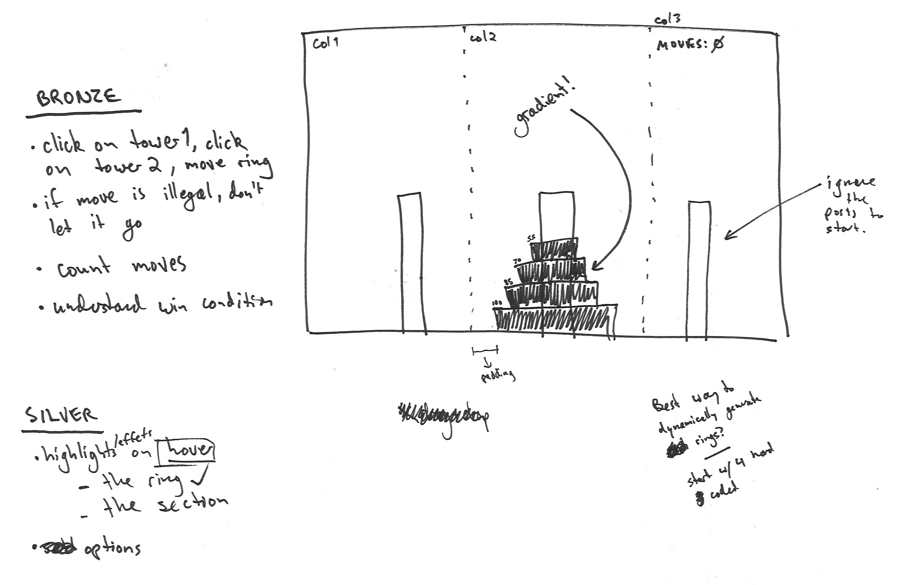

# Tim's Towers of Hanoi

## What is It?
The [Tower of Hanoi](https://en.wikipedia.org/wiki/Tower_of_Hanoi) is a classic math game/puzzle. The object of the game is to move the tower from one column to another, following these three rules:
  1. Only one disk may be moved at a time.
  1. Only the uppermost disk on each stack may be moved from column to column.
  1. No disk may be placed on top of a smaller disk.

## What It's Made Of
HTML, CSS, and JavaScript (with a lot of help from jQuery)

## How I Made It
For this project, I really wanted to take advantage of some of the basics we had been learning about Object Oriented JS. Although we hadn't gotten as far a constructor functions, etc., I know that structuring my game as an object would make this project a lot more manageable.

I started by mocking up a 4-block stack and the game board itself. It didn't take long for me to settle on the 8-bit theme, transforming the game board into an arcade cabinet.

When it came time to add functionality, I began by defining a few methods I knew I would need: `checkMove`, `moveRing`, `checkWin`, and `gameOver`. I was able to code a draft of `checkWin` before I even know how to move blocks from one tower to the next.

Bit by bit, I fleshed out the logic, adding features after each stable commit. Since I had planned ahead, I found it wasn't all that difficult to add new functionality such as allowing players to generate towers of different heights.

I also kept my eye on the visual design and UX throughout. I'm really proud of the animations I added to give everything a more playful, 8-bit look and feel.

## What's Next?
### Refactor into Angular?
This project would be ideally suited to technologies such as Angular or React. I wouldn't have to keep track of DOM positions and general game states separately. This would be a great way to practice refactoring/re-writing old code.

### Add Instructions
It would be a GREAT idea to add instructions somewhere on the page. The easiest way would be to add some text underneath the "arcade" screen. On the other hand, it would be even better if the instructions showed up on the game window itself, just like classic arcade intros.

### Add Timer and Score Tracking
I've played this game _way_ too much now, and can usually get a perfect score. If I really wanted to implement high score tracking, adding a timer would be my best bet:
1. add a timer that starts when a user clicks `start`
1. add a check-box to enable/disable the timer
1. add high score list
  - displayed in the right-hand column next to the level select menu
  - high scores are paired to each tower height
  - moves + time with time as tie-breaker
  - saved to local storage
1. save to a database (Firebase would be ideal)

## Misc Notes

## TL;DR
**What is It?**
An easy to use and mobile-friendly online version of the classic puzzle, [The Tower of Hanoi](https://en.wikipedia.org/wiki/Tower_of_Hanoi).

**What It's Made Of**
HTML, CSS, and jQuery. I'm working on an Angular version on the side.

**What I'm Proud Of**
Take a minute to Google online versions of the Tower of Hanoi and you'll find a lot of clunky versions built with outdated technology (remember [DTML?](http://dynamicdrive.com/dynamicindex12/towerhanoi.htm)). I think mine is both easy to use and visually appealing. I found clicking on columns to be a lot easier than having to drag and drop individual blocks. My version ended up being really well suited to mobile and tablet play.

**What's Next?**

1. I'd like to add a timer and high score table (perhaps using Firebase to host and handle the data)
1. I've already started re-writing the app using Angular.
1. I should really add some instructions...
